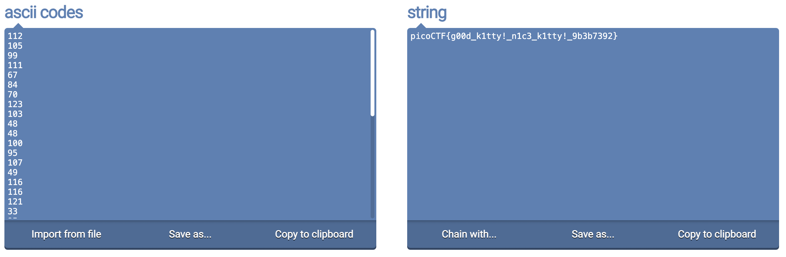

## Nice netcat...
* Points: 15pt
* Tags: `General Skills`, `picoCTF 2021`
## Description
> There is a nice program that you can talk to by using this command in a shell: $ nc mercury.picoctf.net 35652, but it doesn't speak English...
## Hints
> * You can practice using netcat with this picoGym problem: `what's a netcat`?
> * You can practice reading and writing ASCII with this picoGym problem: `Let's Warm Up`
## Solution
1. Open the terminal and type the following commands:
`$ nc mercury.picoctf.net 35652`    
2. Once you connected, you will receive a list of numbers
3. Convert these numbers into a readable string using an [online ASCII to String converter](https://onlinestringtools.com/convert-ascii-to-string)

## Flag
`picoCTF{g00d_k1tty!_n1c3_k1tty!_9b3b7392}`