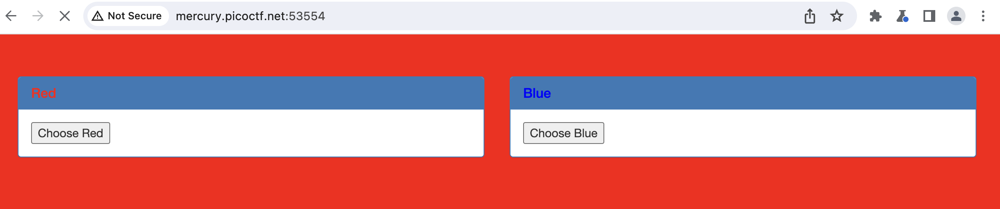
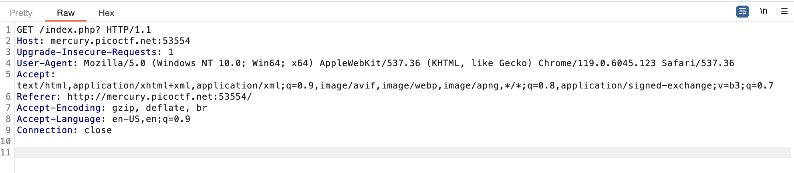
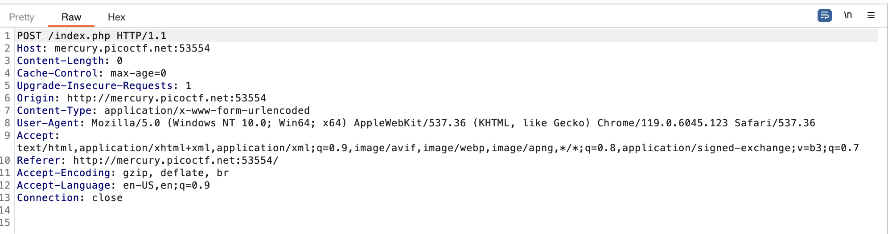
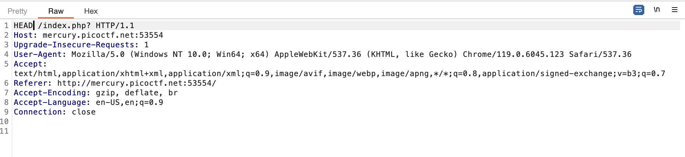
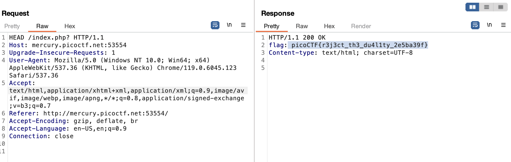

## GET aHEAD
* Points: 20pt
* Tags: `Web Exploitation`, `picoCTF 2021`
## Description
> Find the flag being held on this server to get ahead of the competition http://mercury.picoctf.net:53554/

## Hints
> * Maybe you have more than 2 choices
> * Check out tools like **Burpsuite** to modify your requests and look at the responses

## Solution
Check out the link to download the burpsuite: [Here](https://portswigger.net/burp/communitydownload)
We're going to **manipulate HTTP requests and view their responses** through Burpsuite.

1. Navigate to `proxy` > `Intercept` and turn it on. Open your web browser.
2. Visit the website, and you'll notice a button with red and blue colors. Clicking the button changes the background color.

3. Click on `Choose Red`, and you'll see that clicking the red button triggers a `GET` request.

4. Clicking the blue button triggers a `POST` request. You can learn more about [HTTP methods here](https://developer.mozilla.org/en-US/docs/Web/HTTP/Methods)

5. Now that we know that the website uses two different HTTP methods for each button, there might be an opportunity to manipulate the method and obtain the flag.
6. Given the challenge name, **Get aHEAD,** change the `GET` request to `HEAD` and select `Action` > `Send repeater`.

7. Switch to the repeater view and click `Send` and you'll get the flag!

## Flag
`picoCTF{r3j3ct_th3_du4l1ty_2e5ba39f}`